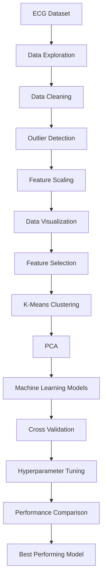

# 📊 Data Mining and Analytics using Machine Learning


---

# 📖 Overview

This project presents a complete **Data Mining and Analytics pipeline** for analyzing physiological ECG-based emotion data using machine learning techniques. The objective is to identify emotional states by combining data preprocessing, feature engineering, clustering, dimensionality reduction, and supervised classification algorithms.

The project demonstrates the practical application of data mining methodologies and machine learning techniques for extracting meaningful insights from structured physiological datasets.

---

## 🎯 Project Objectives

- Explore and analyze physiological ECG data.
- Perform comprehensive data preprocessing and cleaning.
- Detect and handle outliers.
- Visualize feature distributions and relationships.
- Identify the most informative features.
- Apply clustering and dimensionality reduction techniques.
- Train and evaluate multiple machine learning classifiers.
- Compare model performance using cross-validation and hyperparameter tuning.

---

## 🏗 Methodology

The complete workflow consists of the following stages:

1. Data Loading
2. Data Exploration
3. Data Cleaning
4. Outlier Detection & Treatment
5. Feature Scaling
6. Data Visualization
7. Feature Selection
8. K-Means Clustering
9. Principal Component Analysis (PCA)
10. Machine Learning Classification
11. Cross Validation
12. Hyperparameter Tuning
13. Model Evaluation & Comparison

---

## 🔄 Project Workflow



---

# 📂 Dataset

This project uses the **POPANE physiological ECG dataset**, containing numerical features extracted from ECG signals representing multiple emotional states.

The dataset includes:

- Baseline Condition
- Neutral State
- Fear State

Each record contains physiological measurements extracted from ECG signals that are used for emotion classification.

---

# ✨ Features

### Data Preprocessing

- Missing value verification
- Duplicate detection
- Outlier detection using Interquartile Range (IQR)
- Median-based outlier replacement

### Data Visualization

- Feature distributions
- Histograms
- Correlation Heatmap
- Scatter Plots

### Feature Engineering

- Min-Max Scaling
- Label Encoding
- Feature Selection using:
  - SelectKBest
  - Logistic Regression
  - Decision Tree
  - Random Forest

### Clustering

- K-Means Clustering
- Elbow Method

### Dimensionality Reduction

- Principal Component Analysis (PCA)

### Machine Learning Models

- Logistic Regression
- K-Nearest Neighbors (KNN)
- Support Vector Machine (SVM)
- Decision Tree
- Random Forest
- Naïve Bayes

### Model Evaluation

- Accuracy
- Classification Report
- Confusion Matrix
- Cross Validation
- Hyperparameter Tuning using GridSearchCV

---

# 🛠 Technology Stack

| Category | Technologies |
|-----------|--------------|
| Programming Language | Python |
| Notebook Environment | Jupyter Notebook |
| Data Processing | Pandas, NumPy |
| Data Visualization | Matplotlib, Seaborn |
| Machine Learning | Scikit-learn |
| Clustering | K-Means |
| Dimensionality Reduction | PCA |
| Model Optimization | GridSearchCV |

---

# 📁 Repository Structure

```
Data-Mining-and-Analytics/

│
├── dataset/
│   └── Dataset_Study4.csv
│
├── notebooks/
│   └── Data Mining and Analytics Project.ipynb
│
├── README.md
├── requirements.txt
├── LICENSE
└── .gitignore
```

---

# 📈 Experimental Results

Six machine learning models were trained and evaluated.

| Model | Accuracy |
|--------|---------:|
| Logistic Regression | 62% |
| K-Nearest Neighbors | 56% |
| Support Vector Machine | 62% |
| Decision Tree | 40% |
| Random Forest | 44% |
| Naïve Bayes | **66%** |

After hyperparameter tuning, Logistic Regression, Random Forest, and Naïve Bayes demonstrated improved performance, with **Naïve Bayes achieving the highest overall accuracy**.

---

# 📊 Project Highlights

- Complete end-to-end data mining workflow.
- Comprehensive exploratory data analysis.
- Statistical outlier detection using IQR.
- Multiple feature selection techniques.
- K-Means clustering for pattern discovery.
- PCA-based dimensionality reduction.
- Comparison of six machine learning algorithms.
- Cross-validation for robust model evaluation.
- Hyperparameter optimization using GridSearchCV.

---

# 🚀 Future Improvements

- Evaluate additional ensemble learning methods.
- Apply deep learning models for emotion classification.
- Increase dataset size for improved generalization.
- Explore feature engineering using signal-processing techniques.
- Develop a real-time emotion prediction system.

---

# 🙏 Acknowledgements

This project was developed as part of the **Data Mining and Analytics** coursework at the **University of Messina**. It demonstrates the practical application of machine learning, clustering, dimensionality reduction, and statistical data mining techniques for physiological emotion classification.
